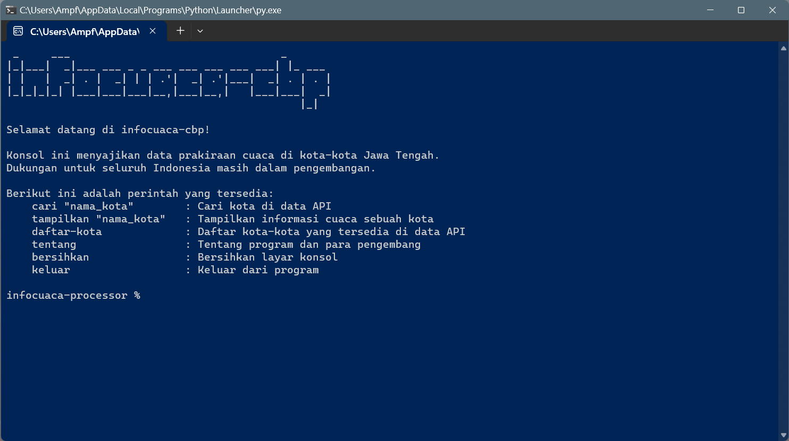

.. _Requests: https://github.com/psf/requests
.. _'Adhiansyah Muhammad Pradana Farawowan': https://github.com/adhiansyahancha
.. _'Muhammad Ralfi': https://github.com/rafiyamanaka
.. _'Dwi Candra Pratama': https://github.com/DCandraPratama
.. _'Dava Ardana V.A': https://github.com/davaardana
.. _'Ade Fatkhul Anam': https://github.com/falnam

infocuaca-cbp
-------------
infocuaca-cbp adalah aplikasi berbasis konsol (*console-based application*, demikian singkatan dari "cbp") yang menampilkan informasi cuaca kota-kota di Jawa Tengah. Dibuat dengan Python 3, informasi cuaca yang disajikan diambil dari API Data Terbuka BMKG dengan pustaka Requests_.

Cara menjalankan
----------------
Buka direktori ``src`` dan jalankan ``main.py`` sebagai skrip.

Tentang aplikasi dan tim
-----------
infocuaca-cbp dikembangkan oleh Tim Pengembang infocuaca-cbp sebagai tugas besar Praktikum Pemrograman 1 Semester 2 S1SE-06-B. Anggota tim terdiri dari:
- 'Adhiansyah Muhammad Pradana Farawowan'_ (sebagai Pemimpin Proyek)
- 'Muhammad Ralfi'_ (sebagai Pemrogram 1 dan *tester*)
- 'Dwi Candra Pratama'_ (sebagai Pemrogram 2)
- 'Dava Ardana V.A'_ (sebagai Pemrogram 3)
- 'Ade Fatkhul Anam'_ (sebagai Desainer)